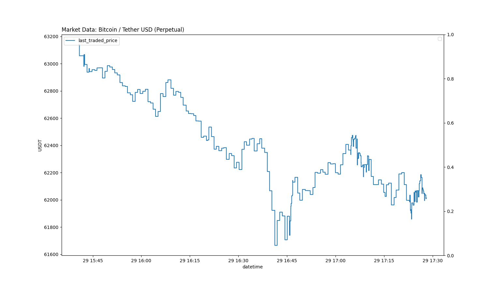
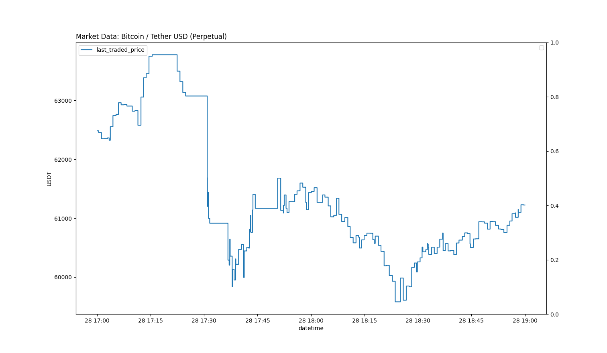
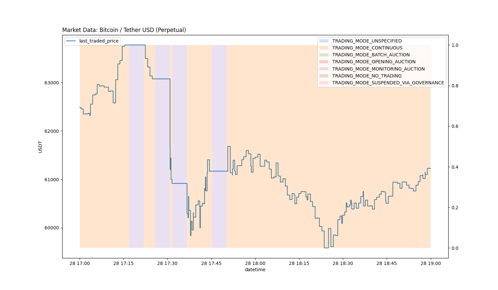
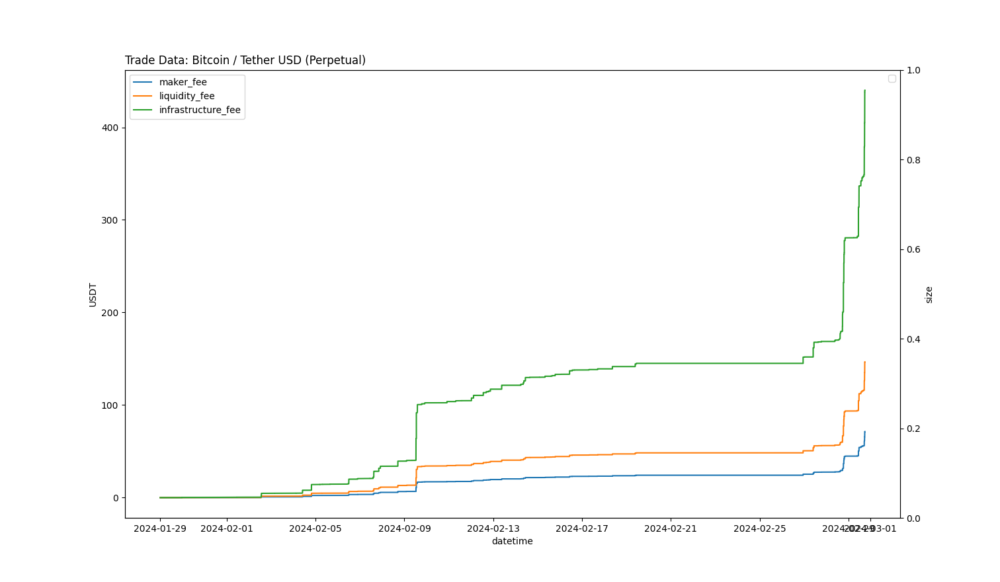

## Examples


## Market Data

The [`market data`](./market_data.py) script visualises data from the `MarketDataHistoryById` endpoint using the market data [plotting tools](/vegapy/plot/market_data.py).

Users are able to use specify what data to plot using flags. For a full list of flags use.

```bash
python -m examples.market_data -h
```

### Examples


Simple plot of the last traded price on the mainnet BTC market (defaults to the last 2 hours of trading).
```bash
python -m examples.market_data -n mainnet -m BTC --last_traded_price
```

A particular period can be requested with by specifying start and end date times.

```bash
python -m examples.market_data -n mainnet -m BTC --last_traded_price --start-datetime 2024-02-28:17:00:00 --end-datetime 2024-02-28:19:00:00
```


Data using different scales will be overlayed using the opposite axis.

```bash
python -m examples.market_data -n mainnet -m BTC --last_traded_price --start-datetime 2024-02-28:17:00:00 --end-datetime 2024-02-28:19:00:00 --trading_mode
```



## Trades

The [`trades`](./trades.py) script visualises data from the `ListTrades` endpoint using the trades [plotting tools](/vegapy/plot/trades.py).

Users are able to use specify what data to plot using flags. For a full list of flags.

```bash
python -m examples.trades -h
```

### Examples


Simple plot of the cumulative fees for the mainnet BTC market.
```bash
python -m examples.market_data -n mainnet -m BTC --maker_fee --liquidity_fee --infrastructure_fee
```
